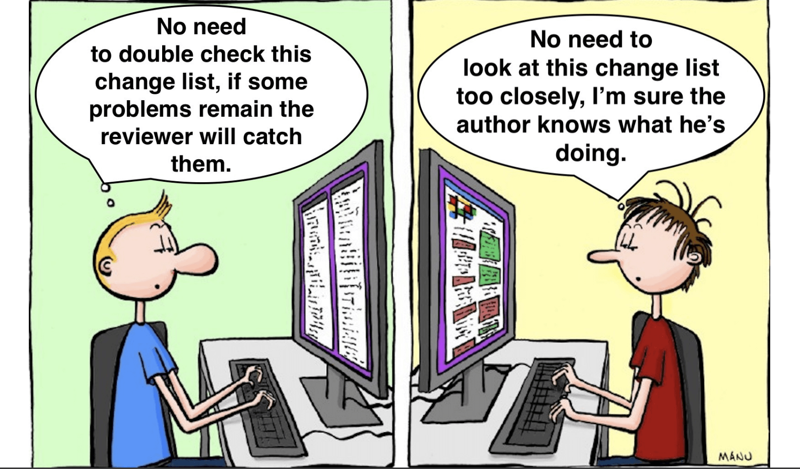

# Code Review Guide

## Github Course

- [Reviewing pull requests | GitHub Learning Lab](https://lab.github.com/githubtraining/reviewing-pull-requests)

## Pros and Cons

| (apparent) Cons  | Pros  |
| --------------------- | ---------------------------------------- |
| adds time demand          | bug rate decreases by 80%                    |
| adds process              | productivity increases by 15%                |
| can bring up team tensions      | share ownership                        |
| "smart" devs think they don't need it | sharing knowledge in the team for when someone gets sick |

## Fundamentals

- Universal code reviews: Everyone should review and be reviewed (junior or senior)
- Ensure consistency:
  - We should agree on a style guide to move away from personal
    preference (we use Google's style guide for R and python)
  - Once we agree on the style guide, start automating things
    with linters (from more painful to less: CI on the code, git
    pre-commit hooks or IDE setups for each developer)
- performed by peers and not management (core review is not performance review)
- no blame culture

## How to code review


As in Maslow's pyramid, each layer requires the previous one.
It is useless for code that is charging the wrong customer to be readable.



## Be a great submitter (when writing a PR)

Provide context with the PR template

YOU are the primary reviewer

- code review is not a tennis game where "the ball is in your court now".
  Review your code with the same level of detail that you would giving reviews.
- make sure the code **works**
- don't rely on others to catch your mistakes

Things to think about

- did I check for **reusable code** or utility methods? is the code **elegant**?
- did I remove debugger statements and prints? is the code **readable**?
- is my code **secure**?
- is my code **maintainable**?

Work in progress

We believe in **starting a review early** so you don’t get too far
only to have to rewrite things after someone has made a great suggestion.

Just create a PR even with a readme commit (when 30 to 50% of the code is
there, it's a good rule of thumb), and add a clear "\[ WIP \]" tag to the
title so that we know it's a work in progress.

The sooner you get feedback, the better: nobody wants to hear at 90%
of the way "you need to redo everything".

Ask for review early and expect architectural design comments.

General Guidelines

- Provide context to the reader = use the PR template
- Review your own code = if needed, build a sandbox
- Expect conversation
- Submit in progress work = see next slide
- Submit reviews **\< 500 lines** of python code
- Use automated tools = see next slides
- Be responsive
- Accept defeat

How to allow maintainers to modify your PR

[Allowing changes to a pull request branch created from a fork - GitHub Docs](https://help.github.com/articles/allowing-changes-to-a-pull-request-branch-created-from-a-fork/)

## Be a great reviewer (When reading a PR)

- Make sure you are aware of the problem/feature.
- Don't be rude, be polite
- Try to avoid the usage of the first person, try to talk about the PR,
  the Code, not about the author!
- Give suggestions and make clear why do you think you suggestion is
  better than the current approach.
- Link to resources, blog posts, stack overflow answers
- Don't point out just the bad things, give compliment as well.
- Ask questions instead of giving answers
- Don't burn out: try to review max 400 lines of code in one session.
  Make it part of your daily workflow. (use github notifications)
- Don't use the words "now simply", "easily", "just", "obviously" ...


"Now, simply stretch and smile"

What to provide feedback on

Code review is not only for experienced developers! Here is what you
can provide feedback on:

- high level business goals
- high level glance at the code and readability check
- setup: can you run it ?
- technical solutions / architecture design / the actual code

How to git checkout a PR
If you need guidance on juggling PRs with the forking workflow, please check out documentation

We can directly fetch a PR code to test something locally.

```sh
git fetch upstream pull/53/head:53
git checkout 53
```

How to push changes to a PR

```sh
git push origin HEAD:refs/pull/{pull number from previous section}/head
```

## References

- [Code Review Skills for Pythonistas - Talk](https://www.youtube.com/watch?v=6L3ZVLtSeo8)
  and [Slides](https://ep2018.europython.eu/media/conference/slides/code-review-skills-for-pythonistas.pdf)
- [Mawslow's pyramid of code review](http://www.dein.fr/2015-02-18-maslows-pyramid-of-code-review.html)
- [Code Reviews: Just Do It](https://blog.codinghorror.com/code-reviews-just-do-it/)
